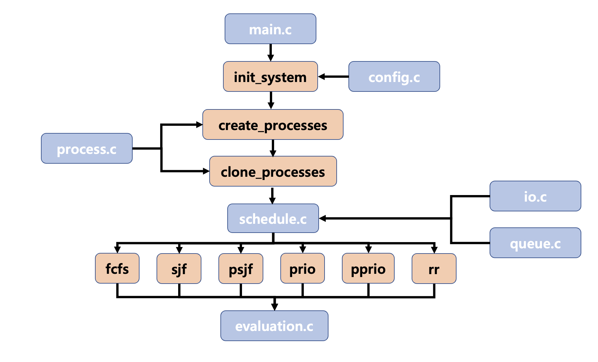

# 20251RCOSE34102
고려대학교 COSE341 운영체제

## Modules

---

## 📁 모듈별 기능 설명

### 🔹 `main.c`
- 프로젝트의 진입점 (`main` 함수 포함).
- 랜덤 프로세스 생성 및 복제.
- 각 스케줄링 알고리즘 실행 함수 호출.
- 전체 실행 결과 출력 및 평가 수행.

### 🔹 `process.c`
- `create_processes(n)`: 랜덤한 속성(도착 시간, 실행 시간, 우선순위)을 가진 프로세스 n개 생성.
- `clone_processes(base, n)`: 생성된 프로세스를 복제하여 각 알고리즘에 동일한 입력으로 사용 가능하게 함.

### 🔹 `schedule.c`
- 주요 CPU 스케줄링 알고리즘 구현:
  - `run_fcfs()`: First-Come-First-Serve
  - `run_sjf()`: Shortest Job First (Non-preemptive)
  - `run_preemptive_sjf()`: Shortest Job First (Preemptive)
  - `run_priority()`: Priority Scheduling (Non-preemptive)
  - `run_preemptive_priority()`: Priority Scheduling (Preemptive)
  - `run_rr()`: Round Robin
- 프로세스 실행 흐름, I/O 요청, 상태 출력 포함.

### 🔹 `queue.c`
- Ready Queue 및 Waiting Queue 관련 함수 구현:
  - `enqueue()`, `dequeue()`, `is_empty()`, `print_ready_queue_state()` 등.
  - 우선순위/남은 실행 시간 기반 선택 함수 포함.
  - 프로세스 제거 및 큐 초기화 유틸리티 포함.

### 🔹 `io.c`
- I/O 요청 감지 및 대기 큐 처리:
  - `check_io_request()`: 프로세스의 I/O 요청 여부 판단.
  - `update_waiting_queue()`: I/O 완료 시 프로세스를 ready queue로 복귀.

### 🔹 `config.c`
- 전역 설정값 정의 및 관리:
  - `TIME_QUANTUM`, `MAX_BURST_TIME`, `IO_PROBABILITY` 등 실험 조건 지정.
  - 상수 값 수정으로 실험 조건 유연하게 변경 가능.

### 🔹 `evaluation.c`
- 알고리즘 성능 평가 및 출력 담당:
  - 각 프로세스의 `waiting_time`, `turnaround_time` 계산.
  - 평균값 산출 및 포맷에 맞춘 결과 출력.
